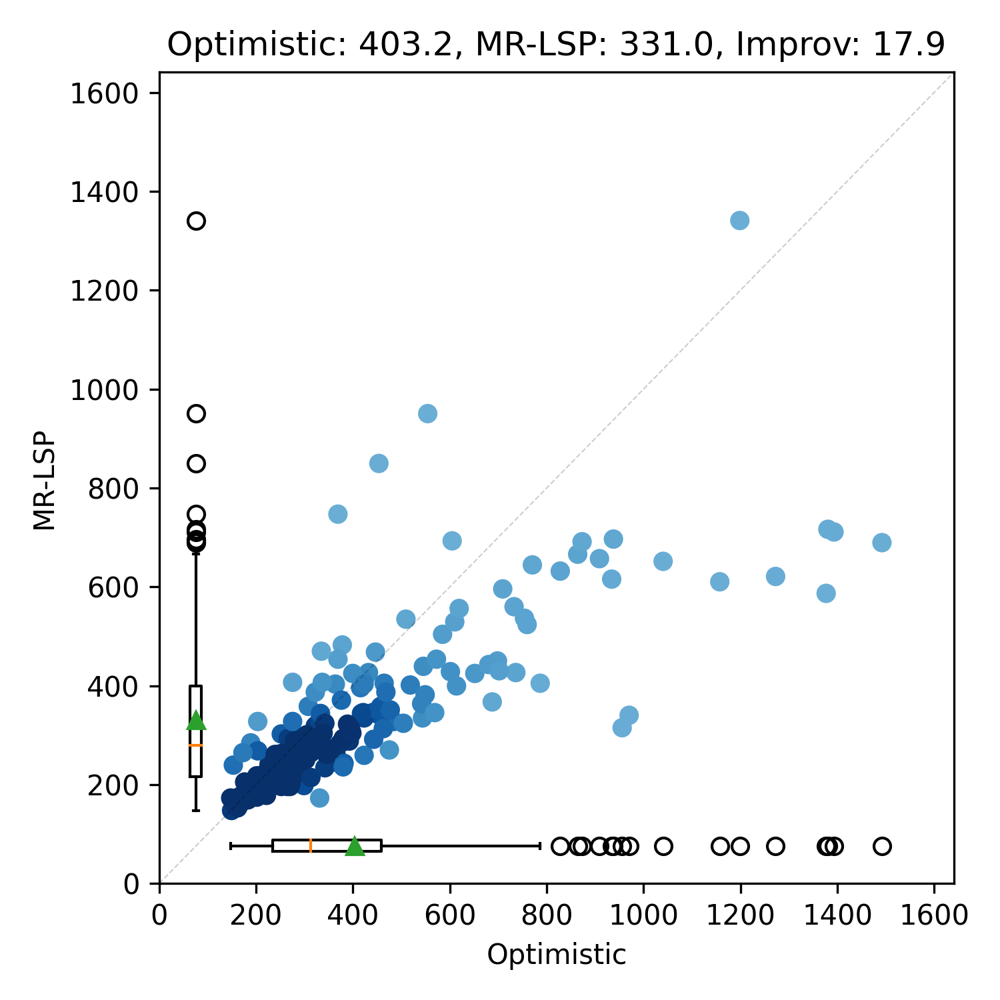

# MR-LSP: Multi-robot Learning over Subgoals Planning

Algorithmic code for Multi-robot Learning over Subgoals Planning (MR-LSP), an extension of the Learning over Subgoals Planning algorithm for multiple robots to find a point goal in partially mapped environments. This module reproduces core algorithm and results presented in the following paper:

Abhish Khanal, and Gregory Stein. "Learning Augmented, Multi-Robot Long-Horizon Navigation in Partially Mapped Environments". In 2023 IEEE International Conference on Robotics and Automation (ICRA). 2023. [paper](https://ieeexplore.ieee.org/stamp/stamp.jsp?arnumber=10161476).

```bibtex
@inproceedings{khanal2023learning,
  title={Learning Augmented, Multi-Robot Long-Horizon Navigation in Partially Mapped Environments},
  author={Khanal, Abhish and Stein, Gregory J},
  booktitle={2023 IEEE International Conference on Robotics and Automation (ICRA)},
  pages={10167--10173},
  year={2023},
  organization={IEEE}
}
```

## Reproducing Results

Note: `make build` (see top-level README) must be successfully run before running the following commands.

The `Makefile.mk` provides multiple targets for reproducing results.
- `make mrlsp-vis` will visualize the planner in office environment.
- `make mrlsp-results` will first generate data using targets described in `lsp` module, trains the neural net, evaluates the planner, and generate results. Running this target produces results as shown below for 1, 2, and 3 robots in 200 procedurally generated `office2` environment.

|  |  |  |
|:--------------------:|:--------------------:|:--------------------:|
| Num_robots = 1          | Num_robots = 2            | Num_robots = 3            |

Each points in the scatter plot represents the cost for MR-LSP to reach the goal compared to an optimistic planner.
